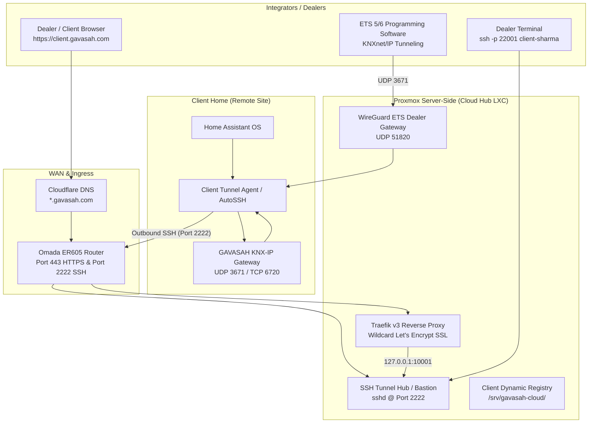

# Gavasah Multi-Tenant Cloud Hub: Architecture & Execution Blueprint

**System Identity:** GAVASAH Soft Tech Private Limited  
**Target Infrastructure:** Proxmox VE Cluster (`primordial-1` / `primordial-3`) + Cloudflare DNS  
**Scope:** Server-Side Infrastructure & Domain Automation (Phase 1)

---

## 1. System Overview & The Three Core Dealer Capabilities



### The Three Required Pillars:
1. **Client Home Dashboard Ingress:**
   * URL format: `https://<client-id>.gavasah.com`
   * Powered by **Traefik v3** with automatic DNS-01 Let's Encrypt wildcard certificates (`*.gavasah.com`).
   * No client-side router configuration or port forwarding needed.
2. **Dealer Remote SSH Administration:**
   * Authorized dealers/admins can execute commands and check health on any client's Home Assistant OS:
     `ssh -p 22001 root@ssh.gavasah.com`
   * Fully audited with dedicated ed25519 key-based authentication.
3. **ETS KNX Device Programming (Crucial):**
   * ETS requires **UDP port 3671** (KNXnet/IP protocol). Standard SSH reverse tunnels only handle TCP.
   * To enable seamless programming of KNX actuators, sensors, and keypads without packet drops or timeouts, we provide two parallel transport paths:
     * **Primary (WireGuard Subnet Mesh):** Integrators connect via WireGuard, and ETS discovers/programs the client's Gavasah KNX Gateway (`192.168.1.111:3671`) as if on the local network.
     * **Secondary (UDP-over-TCP Tunnel via FRP / socat):** Client forwards UDP 3671 directly into the hub for quick ad-hoc ETS sessions.

---

## 2. Infrastructure Inventory & Server Sizing

We deploy a dedicated, high-performance, isolated **Debian 12 LXC Container** on your Proxmox cluster:

| Parameter | Specification | Purpose |
| :--- | :--- | :--- |
| **Container ID / Hostname** | `CT 150` / `gavasah-cloud-hub` | Dedicated multi-tenant ingress & tunnel controller |
| **Host Node** | `primordial-1` (or `primordial-3`) | Dell / Gigabyte hardware on LAN |
| **Resources** | **8 vCPU, 16384 MB (16 GB) RAM, 64 GB NVMe/ZFS** | Enterprise tier: handles 3,000+ concurrent active client tunnels without OOM risk |
| **Static IP** | `192.168.1.150/24` (or `192.168.6.150`) | Dedicated IP behind Omada ER605 |
| **Installed Daemons** | Caddy / Traefik v3, OpenSSH (hardened), WireGuard, Dealer Hub Python Engine | Core services |

> [!TIP]
> **Proxmox Command to Apply 16 GB RAM Instantly:**
> ```bash
> pct set 150 -cores 8 -memory 16384 -swap 4096
> pct reboot 150
> ```

---

## 3. Step-by-Step Implementation Plan

### Step 1: Cloudflare & Domain Configuration
1. **Wildcard DNS Record:** Add `A` record `*.gavasah.com` pointing to your Dual-WAN router public IP (or setup Cloudflare Load Balancer failover between Airtel & ACT).
2. **SSH & VPN Records (DNS Only / Grey Clouded):**
   * `ssh.gavasah.com` → Proxied: **OFF** (Port 2222 SSH cannot be proxied by Cloudflare CDN).
   * `knx.gavasah.com` → Proxied: **OFF** (UDP 51820 for ETS WireGuard).
3. **Cloudflare API Token:** Create an API token with `Zone:DNS:Edit` permissions for Traefik's automatic Let's Encrypt DNS-01 ACME challenge.

### Step 2: Proxmox LXC Container Deployment (`gavasah-cloud-hub`)
1. Create Debian 12 LXC container (`CT 150`) on Proxmox node.
2. Configure persistent directory tree:
   * `/srv/gavasah-cloud/traefik/` (Traefik static & dynamic configuration)
   * `/srv/gavasah-cloud/dynamic/` (`clients.yaml` auto-reloaded by Traefik)
   * `/srv/gavasah-cloud/tunnels/` (Client tunnel configs & port registry)
   * `/srv/gavasah-cloud/keys/` (Client authorized public keys)
   * `/srv/gavasah-cloud/wireguard/` (ETS Dealer VPN configs)

### Step 3: Configure OpenSSH Bastion (Tunnel Hub)
1. Configure `/etc/ssh/sshd_config.d/gavasah_tunnels.conf`:
   * Listen on Port `2222`.
   * Enable `GatewayPorts yes` and `AllowTcpForwarding yes`.
   * Create locked-down user `tunnel-client` with `/usr/sbin/nologin` (can only forward ports, cannot run shell commands).
   * Dedicated dealer admin accounts for remote diagnostics (`ha host info`, `df -h`).

### Step 4: Configure Traefik v3 with Wildcard SSL
1. Configure `traefik.yaml` with Cloudflare DNS-01 ACME challenge.
2. Enable hot-reloading file provider watching `/srv/gavasah-cloud/dynamic/`.
3. Test issuance of `*.gavasah.com` wildcard certificate.

### Step 5: Configure KNX ETS Tunneling Engine
1. Configure WireGuard / FRP UDP relay for ETS programming.
2. Test UDP 3671 routing to verify latency is under 30ms (mandatory for ETS programming stability).

### Step 6: Router Port Forwarding on Omada ER605
1. Port `443` (TCP) → `192.168.1.150:443` (Traefik HTTPS)
2. Port `80` (TCP) → `192.168.1.150:80` (Traefik HTTP → HTTPS redirect)
3. Port `2222` (TCP) → `192.168.1.150:2222` (SSH Ingress Hub)
4. Port `51820` (UDP) → `192.168.1.150:51820` (ETS WireGuard Gateway)

---

## 4. Client Deterministic Port Allocation Scheme

Each onboarded client receives a deterministic block of 10 ports:

| Client ID | Client Slug | Dashboard (HTTP) | Remote SSH Shell | KNX / ETS Relay | Subdomain |
| :--- | :--- | :--- | :--- | :--- | :--- |
| `1` | `sharma-villa` | `10001` | `22001` | `36701` | `https://sharma-villa.gavasah.com` |
| `2` | `verma-residence` | `10002` | `22002` | `36702` | `https://verma-residence.gavasah.com` |
| `3` | `gavasah-hq` | `10003` | `22003` | `36703` | `https://gavasah-hq.gavasah.com` |
